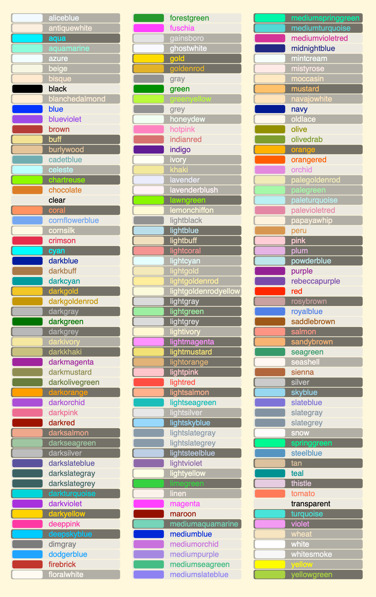

## Colour specification

Colours can be specified in the following ways:
1. By [name](#names) e.g. `rebeccapurple`. The HTML standard names are supported plus a few more. The alpha value is set to 255.
2. Using a hex code. The following alternatives are supported:
    - `#rgb` e.g. `#888`
    - `#rgba` e.g. `#fff7`
    - `#rrggbb` e.g. `#f0f8ff`
    - `@rrggbbaa` e.g. `#f0f8ff7f`
    When an alpha isn't specified it is set to `255`
3. Using `RGB()` or `RGBA()`. The red, green and blue values must be in the range `0...255` while the 
alpha value can be `0...255` or `0.0...1.0`. The switch between the two alpha formats is determined by the
presence of the decimal point, `0` is of course the same as `0` but `1` is quite different to `1.0`.
4. Prefixing one of the above with `clear-` halves it's alpha, `clear-clear-` works two but it seems a bit pointless.

### <a id="names">Colour names</a>

