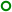

# Settings

The settings file is [JSON](https://en.wikipedia.org/wiki/JSON) encoded and the following
tags are supported, the data type and default value are shown in parathenses. Some values can be set from the command line and these are shown.

**backgroundColour** (String) [9](#fn9) 
**Option:**`--bg` 
The background colour for the Canvas or SVG

**bared** (Int **0**) 
**Option:** `--bared` 
A bit vector of the plots to draw as bars.[5](#fn5)

**barOffset** (Int **-1**) 
**Option:** `--baroffset` 
The offset of each bar from the adjacent one. 
If it is less than 0 then it is calculated.

**barWidth** (Int **1**) 
**Option:** `--barwidth` 
The width of each bar. 
If it is less than or equal to 0 then it is calculated.

**baseFontSize** (Double **10.0**) 
**Option:** `--size` 
The base font size for the Canvas or SVG, all other font sizes are derived from this value

**bezier** (Double **0.0**) 
**Option:** `--bezier` 
**Allowed values:** From 0 to 0.5
Each join is converted to a quadratic Bézier curve. The `bezier` value determines where the curve begins and ends,
e.g. setting it to .25 means that the curve starts at 25% of the way from the current point to the previous point and ends
25% of the way to the next point. The current point becomes the control point. If showDataPoints is set then the actual
datapoint is shown. Setting this to more than .5 or less than 0 isn't going to produce anything readable.

**black** (Bool **false**) 
**Option:** `--black` 
Set undefined plot colours to "black"

**bold** (Bool **false**) 
**Option:** `--bold` 
Use bold text.

**bounded** (Bool **true**) 
**Option:** `--nobounds` [8](#fn8) 
Bounds check some parameters

**canvas** (String)[canvas](#fncanvas) 
**Option:** `--canvas` 
The id of the canvas to write to.

**colours** (Array of Strings) [9](#fn9) 
**Option:** `--colours`[6](#fn6) 
The colours to be used to plot the column or row. The index, if present, must be included although never used.
Columns or rows that aren't defined are assigned a colour sequentially from an internal list.
More on colours can be found [here](colours.md).

**comment** (Bool **true**) 
**Option:** `--nocomment` [8](#fn8) 
Add an identifying comment to the SVG

<a id="cssClasses">**cssClasses** (Array of Strings)</a>[svg](#fnsvg) 
The elements of the SVG use CSS for styling with each plot having it's own class. The classes in this list are assigned
to each row or column in turn including the index. Plots not included in this list are assigned an automatically generated class. 
There are no restrictions on the contents so that multiple classes can be attached to a plot by using a space seperated list for
each entry. 
For more information see (css.md)[css.md]

<a id="cssExtras">**cssExtras** (Array of Strings)</a>[svg](#fnsvg) 
The strings in this array are copied into a `<style>` tag.

<a id="cssID">**cssID** (String)</a>[svg](#fnsvg) 
**Option:** `--cssid` 
The style tags of SVG's can affect each other when they are included in an HTML document. For this reason every `<svg>` tag
has an `id` defined. It can be this id or a random one. If the `cssID` is set to _"none"_ then no id is added to the SVG.

<a id="cssInclude">**cssInclude** (String)</a>[svg](#fnsvg) 
**Option:** `--css` 
The contents of the file named by this string are included in a separate `<style>` tag.

**dashedLines** (Int **0**) 
**Option:** `--dashed` 
A bit vector of the plots to draw as dashed lines.[5](#fn5)

**dashes** (Array of Strings) 
**Option:** `--dashes`[6](#fn6) 
The dash patterns to be used to plot the column or row. These are a list of numbers seperated by either a space or a comma.
Each string forms one dash e.g. `--dashes 1,2,3 "4 5 6"` defines 2 dash patterns.
[See](https://developer.mozilla.org/en-US/docs/Web/SVG/Attribute/stroke-dasharray) for more details.
The index, if present, must be included although never used.
Columns or rows that aren't defined are assigned a pattern sequentially from an internal list.

**dataPointDistance** (Double **10.0**) 
**Option:** `--distance` 
The minimum number of pixels between adjacent data points.

**filled** (Int **0**) 
**Option:** `--filled` 
A bit vector of the plots to draw filled.[5](#fn5)

**fontFamily** (String) 
**Option:** `--font` 
The font family to use for text.

**foregroundColours** (Dictionary of Strings) [9](#fn9) 
**Option:** `--fg` 
**Option:** `--textcolour` 
The colours of the elements on the chart separate from the plots can be set using the foregroundColours dictionary.
Colours that aren't defined are set to the options above `--texrcolour` sets the text and  `--fg` sets the rest. The
keys for the dictionary are:

- **axes**: sets the colours for the abscissa, ordinate and grid. The grid has a lower alpha value making it appear lighter.
- **legends**: the colour for the word "Legends".
- **legendsBox**: the box around the legends where once again the alpha is lowered.
- **pieLegend**: the text under pie charts.
- **subTitle**: the text under the title.
- **title**: the title.
- **xLabel**: the value markers for the abscissa.
- **xTags**: the extra markers for the abscissa.
- **xTitle**: the text describing the abscissa.
- **yLabel**: the value markers for the ordinate.
- **yTitle**:  the text describing the ordinate.

**headerColumns** (Int **0**) 
**Option:** `--headers`[4](#fn4) 
**Allowed values:** From 0 to 25
The number of columns that do not contain data.[1](#fn1)

**headerRows** (Int **0**) 
**Option:** `--headers`[4](#fn4) 
**Allowed values:** From 0 to 25
The number of rows that do not contain data.[1](#fn1)

**height** (Int **600**) 
**Option:** `--height` 
The height of the generated Canvas or SVG

**hover** (Bool **true**)[svg](#fnsvg) 
**Option:** `--nohover` [8](#fn8) 
Add the css to emphasize the hovered over plot.

**include** (Int **-1**) 
**Option:** `--include` 
A bit vector of the plots to draw.[5](#fn5) 
The default is to draw all.

**index** (Int **0**) 
**Option:** `--index` 
**Allowed values:** From 0 to 25
The column or row that contains the absissa data with the leftmost column or top row being 1. 
If it is less than or equal to zero then the absica is 0 for the first value of each plot and so on.

**italic** (Bool **false**) 
**Option:** `--italic` 
Use italic text.

**legends** (Bool **true**) 
**Option:** `--nolegends` [8](#fn8) 
Add the legends panel if there is room.

**logoHeight** (Int **64**) 
The height of the logo `<image>` element.

<a id="logoURL">**logoURL** (String)</a> 
**Option:** `--logo` 
The URL of an image to include in the top right corner of the plot. By default the logo
element is 64x64 but this can be changed.
Other sized images are scaled to fit while preserving the aspect ratio and fitting the top right
corner of the image in the top right corner of the plot.

**logoWidth** (Int **64**) 
The width of the logo `<image>` element.

**logx** (Bool **false**) 
**Option:** `--logx` 
The abcissa uses a logarithmic scale

**logy** (Bool **false**) 
**Option:** `--logy` 
The ordinate uses a logarithmic scale

**nameHeader** (Int **1**) 
**Option:** `--nameheader` 
**Allowed values:** From 0 to 25
The row or column that contains the names of plots. If it is less than or equal to zero
the the name is never fetched from the csv.

**names** (Array of Strings) 
**Option:** `--names`[6](#fn6) 
The plotted column or rows are assigned names from this array or the first header row or column respectively. If not defined in either place then a name is generated.
The names are included with the colours associated with the plots under the plot area.

**opacity** (Double **1.0**) 
**Option:** `--opacity` 
**Allowed values:** From 0 to 1.0
The opacity of the plots.

**reserveBottom** (Double **0.0**) 
**Option:** `--reserve`[7](#fn7) 
Reserve space on the bottom of the Canvas or SVG

**reserveLeft** (Double **0.0**) 
**Option:** `--reserve`[7](#fn7) 
Reserve space on the left side of the Canvas or SVG

**reserveRight** (Double **0.0**) 
**Option:** `--reserve`[7](#fn7) 
Reserve space on the right side of the Canvas or SVG

**reserveTop** (Double **0.0**) 
**Option:** `--reserve`[7](#fn7) 
Reserve space on the top of the Canvas or SVG

**rowGrouping** (Bool **false**) 
**Option:** `--rows` 
The data is grouped in rows

**scatterPlots** (Int **0**) 
**Option:** `--scattered` 
A bit vector of the plots to draw as scatter plots.[5](#fn5)

**shapes** (Array of Strings) 
**Option:** `--shapes`[6](#fn6) 
A list of shape names to be used in scatter plots. The names are taken sequentially from
the list and assigned to scatter plots. If there are too few shape names or they cannot be
looked up the a shape from an internal list is assigned.

Recognized names are:
1.  blade
1.  circle
1.  circleStar
1.  cross
2.  diamond
2.  shuriken
3.  square
4.  star
5.  triangle

**showDataPoints** (Int **0**) 
**Option:** `--datapoints` 
A bit vector of the plots to draw with data points.[5](#fn5)

**smooth** (Double **0.0**) 
**Option:** `--smooth` 
**Allowed values:** From 0 to 0.99
Smooth the ordinate values using an
[Exponential Moving Average](https://en.wikipedia.org/wiki/Moving_average#Exponential_moving_average)
The value for smooth is actually `1 - α` as it makes more sense to me for no smoothing to be `0.0` rather than `1.0`.

**sortx** (Bool **false**) 
**Option:** `--sortx` 
Sort the points based on the x value before plotting.

<a id="strokeWidth">**strokeWidth** (Double **2.0**)</a> 
**Option:** `--stroke` 
**Allowed values:** From 0 to 100
The width of the plotted paths

**subTitle** (String) 
**Option:** `--subtitle` 
The sub-title attached to the Canvas or SVG

**subTitleHeader** (Int **0**) 
**Option:** `--subheader` 
**Allowed values:** From 0 to 25
The row or column that contains the sub-title. If it is less than or equal to zero
the the name is never fetched from the csv. If the sub-title is defined by the option
above then the csv is not checked. Embedded commas will probably cause problems. 
**N.B.** leading and trailing double quotes and spaces are stripped from csv data when
it is read, they have no effect on how the data is interpreted.

<a id="svgInclude">**svgInclude** (String)</a>svg(#fnsvg) 
**Option:** `--svg` 
This options is the path of a file to include at the end the SVG, just before the `</svg>`

**title** (String) 
**Option:** `--title` 
The title attached to the Canvas or SVG

**width** (Int **800**) 
**Option:** `--width` 
The width of the generated Canvas or SVG.

**xMax** (Double **-inf**) 
**Option:** `--xmax` 
The maximum value for the abscissa.[2](#fn2)

**xMin** (Double **inf**) 
**Option:** `--xmin` 
The minimum value for the abscissa.[2](#fn2)

**xTick** (Double **0**) 
How often to print the abscissa values and draw a line.[3](#fn3)

**xTitle** (String) 
The title attached to the abscissa.

**yMax** (Double **-inf**) 
**Option:** `--ymax` 
The maximum value for the ordinate.[2](#fn2)

**yMin** (Double **inf**) 
**Option:** `--ymin` 
The minimum value for the ordinate.[2](#fn2)

**yTick** (Int **0**) 
How often to print the ordinate values and draw a line.

**yTitle** (String) 
the title attached to the ordinate

### Footnotes

- <a id="fn1">1</a>: header columns or rows are used to name the path plotted.

- <a id="fn2">2</a>: if not defined the min and max are taken from the data.

- <a id="fn3">3</a>: setting this to -1 will remove the ticks.

- <a id="fn4">4</a>: `--headers` will set both headerColumns and headerRows

- <a id="fn5">5</a>: A bit vector is an integer where each bit represents a plot
e.g. _25 == 24 + 23 + 20_ which would mean that the
fifth, fourth and first row or column would be enabled. A value of -1 means all plots. 
To simplify the calculation the `--bitmap` option can be used e.g. 
`csv2 --bitmap 5 4 1` gives `25`.

- <a id="fn6">6</a>: These options accept a list of words separated by spaces up until the next flag
or option. If there are none before the file names then a `--` can be used to terminate the list.

- <a id="fn7">7</a>: Although there are 4 paramaters there is only one command line option. The option can
have between 1 and 4 values, these values are assigned to the sides in turn. 
Hence `--reserve 1 2 3 4` is the same as `reserveLeft: 1`, `reserveTop: 2`, `reserveRight 3` and,
`reserve Bottom: 4`.

- <a id="fn8">8</a>: The command line arguments are the opposite of the JSON settings, `--noxxx` sets
`xxx` to `false`.

- <a id="fn9">9</a>: Specifying colours is covered [here](colours.md)

- <a id="fncanvas">canvas</a>: Only when creating a Canvas plot

- <a id="fnsvg">svg</a>: Only when creating an SVG plot
