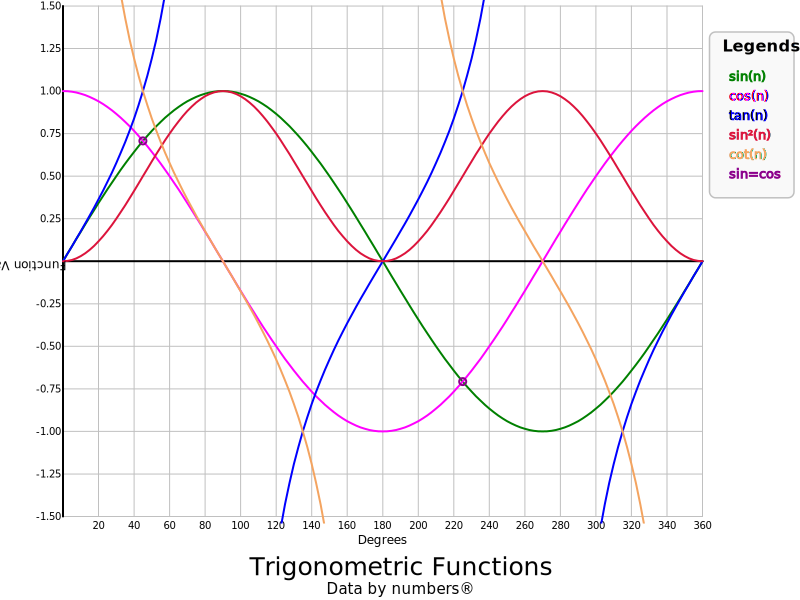
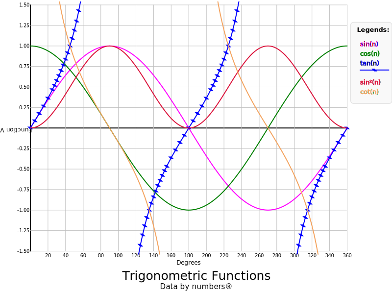
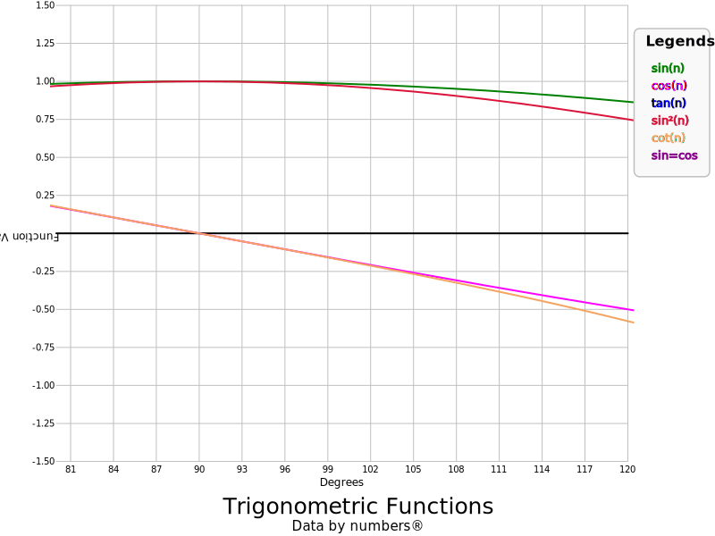

### csv2svg examples

This [csv](trig.csv) file and [json](trig.json) were combined with `csv2svg trig.csv trig.json > trig.svg` to produce:

It is easy to add data points to the SVG, `csv2svg --showpoints=8 trig.csv trig.json > trig-points.svg` will add data points to the tan curve:

The value 8 is 2³ which means that the data in the 4th column is shown with data points. It is also the 3rd plot as the first column isn't displayed,
it contains the abscissa data. Not all data points are displayed as that makes the display a little busy.

We can also zoom in by restricting the abscissa or ordinate. The ordinate has already been restricted as tan values can be so large that the other curves
aren't seen. The command `csv2svg --xmin=80 --xmax=120 trig.csv trig.json > trig-80-120.svg` restricts the abscissa to between 80° and 120°:

Note that the markings on the abscissa have changed and none of the SVG's match the value set in the JSON file.
This is because the programme checks that the spacing is suitable and adjusts it is required.
