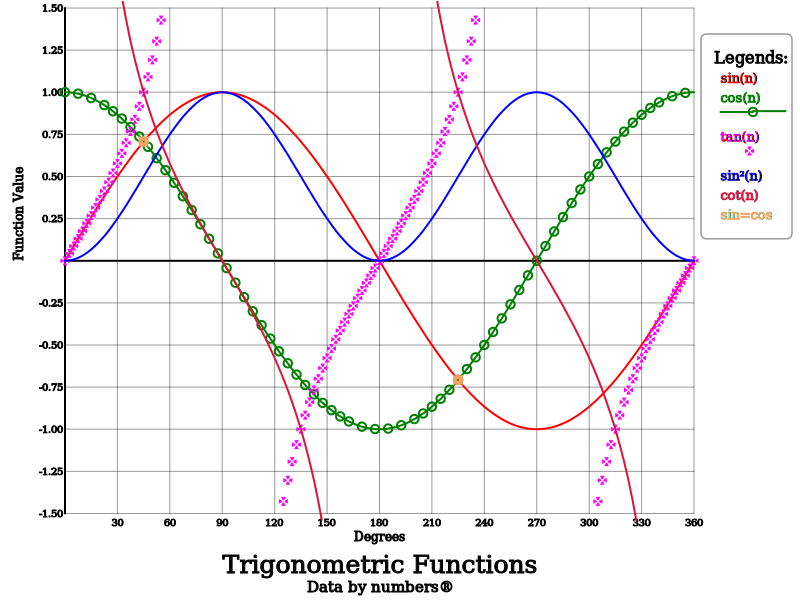
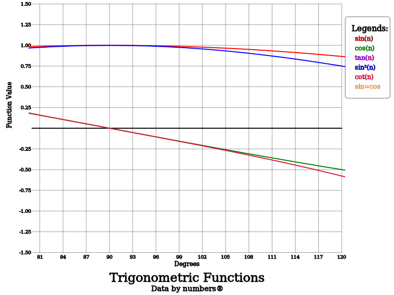

### csv2svg examples

This [csv](trig.csv) file and [json](trig.json) were combined with `csv2svg trig.csv trig.json > trig.svg` to produce:

It is easy to add data points or scatter plots to the SVG, 
`csv2svg --showpoints=8 --scattered=16 trig.csv trig.json > trig-points.svg` will add data points to the tan curve and make sin² a scatter plot:

The value 8 is 2³ which means that the data in the 4th column is shown with data points. It is also the 3rd plot as the first column isn't displayed,
it contains the abscissa data. Not all data points are displayed as that makes the display a little busy. The scatter plot displays all data points.
Note that the legend display for tan(n) changed to indicated that data points are displayed and that sin²(n) is a scatter plot.

We can also zoom in by restricting the abscissa or ordinate. The ordinate has already been restricted as tan values can be so large that the other curves
aren't seen. The command `csv2svg --xmin=80 --xmax=120 trig.csv trig.json > trig-80-120.svg` restricts the abscissa to between 80° and 120°:

Note that the markings on the abscissa have changed and none of the SVG's match the value set in the JSON file.
This is because the programme checks that the spacing is suitable and adjusts it is required.

Individual plots can be selected using `--include`.
Here the tan and cot plots are displayed with the command: 
`csv2svg --include=40 trig.csv trig.json > trig-2plots.svg` 
The default is to include all plots which is why the default value for `--include` is -1.

