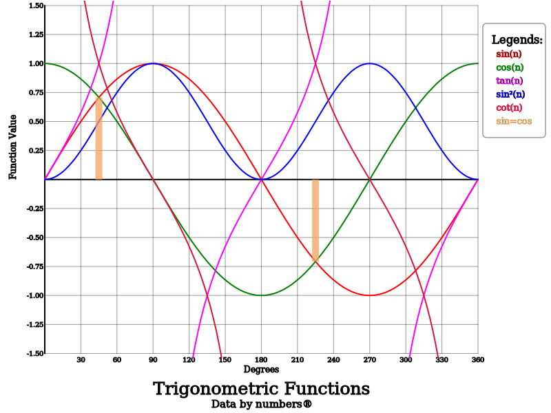

### csv2 examples

This [csv](../data/trig.csv) file and [json](trig.json) were combined with `csv2svg trig.csv trig.json trig.svg` to produce:

Note that when we have a single point and hence can't draw a line we draw a circled star instead. The final plot (`sin=cos`)
consists of two points where the curves cross.

It is easy to add data points or scatter plots to the SVG, 
`csv2 svg --showpoints 4 --scattered 5 trig.csv trig.json trig-points.svg` will add data points to the tan 
curve and make sin² a scatter plot:

We can also zoom in by restricting the abscissa or ordinate. The ordinate has already been restricted as tan values can be so 
large that the other curves aren't seen. The command 
`csv2 svg --xmin=80 --xmax=120 trig.csv trig.json trig-80-120.svg` restricts the abscissa to between 80° and 120°:

Note that the markings on the abscissa have changed and none of the SVG's match the value set in the JSON file.
This is because the programme checks that the spacing is suitable and adjusts it is required.

Individual plots can be selected using `--include`.
Here the tan and cot plots are displayed with the command: 
`csv2 svg --include 5 7 trig.csv trig.json trig-2plots.svg` 
The default is to include all plots which is why the default value for `--include` is `all`.

As well as drawing lines and points we can add bars.

Because the points are so close together the offset and width need to be specified. 
`csv2 svg --bared 8 --barwidth 10 --baroffset 0 trig.csv trig.json trig-bar.svg`
