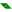
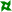
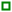
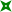
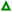

# Settings

The settings file is [JSON](https://en.wikipedia.org/wiki/JSON) encoded and the following
tags are supported, the data type and default value are shown in parathenses. Some default values can be set from the command line and these are shown however these are overridden by the JSON file settings.

**backgroundColour** (String) 
**Option:**`--bg` 
The background colour for the svg

**baseFontSize** (Double **10.0**) 
**Option:** `--size` 
The base font size for the SVG, all other font sizes are derived from this value

**black** (Bool **false**) 
**Option:** `--black` 
Set undefined plot colours to "black"

**bold** (Bool **false**) 
**Option:** `--bold` 
Use bold text.

**colours** (Array of Strings) 
**Option:** `--colours`[6](#fn6) 
The colours to be used to plot the column or row. The index, if present, must be included although never used.
Columns or rows that aren't defined are assigned a colour sequentially from an internal list.

**dashedLines** (Int **0**) 
**Option:** `--dashed` 
A bit vector of the plots to draw as dashed lines.[5](#fn5)

**dashes** (Array of Strings) 
**Option:** `--dashes`[6](#fn6) 
The dash patterns to be used to plot the column or row. These are a list of numbers seperated by either a space or a comma.
Each string forms one dash e.g. `--dashes 1,2,3 "4 5 6"` defines 2 dash patterns.
[See](https://developer.mozilla.org/en-US/docs/Web/SVG/Attribute/stroke-dasharray) for more details.
The index, if present, must be included although never used.
Columns or rows that aren't defined are assigned a pattern sequentially from an internal list.

**dataPointDistance** (Double **10.0**) 
**Option:** `--distance` 
The minimum number of pixels between adjacent data points

**fontFamily** (String) 
**Option:** `--font` 
The font family to use for text.

**headerColumns** (Int **0**) 
**Option:** `--headers`[4](#fn4) 
The number of columns that do not contain data.[1](#fn1)

**headerRows** (Int **0**) 
**Option:** `--headers`[4](#fn4) 
The number of rows that do not contain data.[1](#fn1)

**height** (Int **600**) 
**Option:** `--height` 
The height of the generated SVG

**include** (Int **-1**) 
**Option:** `--include` 
A bit vector of the plots to draw.[5](#fn5) 
The default is to draw all.

**index** (Int **0**) 
**Option:** `--index` 
The column or row that contains the absissa data with the leftmost column or top row being 1. 
If it is less than or equal to zero then the absica is 0 for the first value of each plot and so on.

**italic** (Bool **false**) 
**Option:** `--italic` 
Use italic text.

**logx** (Bool **false**) 
**Option:** `--logx` 
The abcissa uses a logarithmic scale

**logy** (Bool **false**) 
**Option:** `--logy` 
The ordinate uses a logarithmic scale

**nameHeader** (Int **1**) 
**Option:** `--nameheader` 
The row or column that contains the names of plots. If it is less than or equal to zero
the the name is never fetched from the csv.

**names** (Array of Strings) 
**Option:** `--names`[6](#fn6) 
The plotted column or rows are assigned names from this array or the first header row or column respectively. If not defined in either place then a name is generated.
The names are included with the colours associated with the plots under the plot area.

**rowGrouping** (Bool **false**) 
**Option:** `--rows` 
The data is grouped in rows

**scatterPlots** (Int **0**) 
**Option:** `--scattered` 
A bit vector of the plots to draw as scatter plots.[5](#fn5)

**shapes** (Array of Strings) 
**Option:** `--shapes`[6](#fn6) 
A list of shape names to be used in scatter plots. The names are taken sequentially from
the list and assigned to scatter plots. If there are too few shape names or they cannot be
looked up the a shape from an internal list is assigned.

Recognized names are:
1.  blade
1.  circle
2.  diamond
2.  shuriken
3.  square
4.  star
5.  triangle

**showDataPoints** (Int **0**) 
**Option:** `--datapoints` 
A bit vector of the plots to draw with data points.[5](#fn5)

**smooth** (Double **0.0**) 
**Option:** `--smooth` 
Smooth the ordinate values using an
[Exponential Moving Average](https://en.wikipedia.org/wiki/Moving_average#Exponential_moving_average)
The value for smooth is actually `1 - α` as it makes more sense to me for no smoothing to be `0.0` rather than `1.0`.

**sortx** (Bool **false**) 
**Option:** `--sortx` 
Sort the points based on the x value before plotting.

**strokeWidth** (Double **2.0**) 
**Option:** `--stroke` 
The width of the plotted paths

**subTitle** (String) 
**Option:** `--subtitle` 
The sub-title attached to the SVG

**subTitleHeader** (Int **0**) 
**Option:** `--subheader` 
The row or column that contains the sub-title. If it is less than or equal to zero
the the name is never fetched from the csv. If the sub-title is defined by the option
above then the csv is not checked. Embedded commas will probably cause problems. 
**N.B.** leading and trailing double quotes and spaces are stripped from csv data when
it is read, they have no effect on how the data is interpreted.

**title** (String) 
**Option:** `--title` 
The title attached to the SVG

**width** (Int **800**) 
**Option:** `--width` 
The width of the generated SVG.

**xMax** (Double **-inf**) 
**Option:** `--xmax` 
The maximum value for the abscissa.[2](#fn2)

**xMin** (Double **inf**) 
**Option:** `--xmin` 
The minimum value for the abscissa.[2](#fn2)

**xTick** (Double **0**) 
How often to print the abscissa values and draw a line.[3](#fn3)

**xTitle** (String) 
The title attached to the abscissa.

**yMax** (Double **-inf**) 
**Option:** `--ymax` 
The maximum value for the ordinate.[2](#fn2)

**yMin** (Double **inf**) 
**Option:** `--ymin` 
The minimum value for the ordinate.[2](#fn2)

**yTick** (Int **0**) 
How often to print the ordinate values and draw a line.

**yTitle** (String) 
the title attached to the ordinate

### Footnotes

<a id="fn1">1</a>: header columns or rows are used to name the path plotted.

<a id="fn2">2</a>: if not defined the min and max are taken from the data.

<a id="fn3">3</a>: setting this to -1 will remove the ticks.

<a id="fn4">4</a>: `--headers` will set both headerColumns and headerRows

<a id="fn5">5</a>: A bit vector is an integer where each bit represents a plot
e.g. _25 == 24 + 23 + 20_ which would mean that the
fifth, fourth and first row or column would be enabled. A value of -1 means all plots. 
To simplify the calculation the `--bitmap` option can be used e.g. 
`csv2svg --bitmap 5 4 1` gives `25`.

<a id="fn6">6</a>: These options accept a list of words separated by spaces up until the next flag
or option. 
If there are none before the file names then a `--` can be used to terminate the list.
